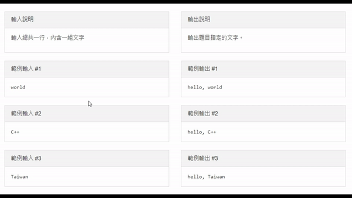
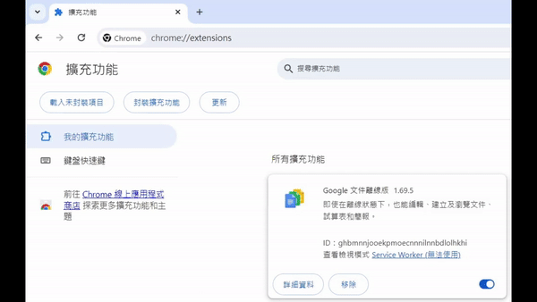

<h1>Zerojudge Auto Copier</h1>
<a href="md\README.MD">chinese version</a>

### this is a `chrome extension` which can `auto copy` the `input`and`output`on zerojudge<a href="#1" target=_self>1</a>
</img>

<h1>Usage</h1>

1. ### unzip [release](https://github.com/x1ulan/zerojudge-extension/releases/tag/1.0),
2. ### go to`chrome://extensions`,
3. ### open `developor mode`<a href="#2" target=_self>2</a>,
</img>

4. ### open the folder you just unzip<a href="#3" target=_self>3</a>.
</img>

