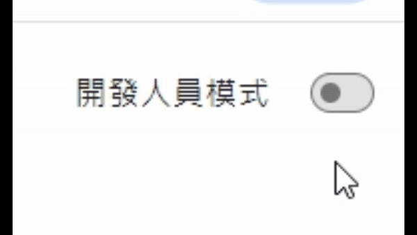

# Zerojudge 一鍵複製測資
[英文版本](../README.MD)
### 這是一個 `chrome擴充套件`
### 能夠`一鍵複製`zerojudge中的`測資`及`輸出`<a href="#1" target=_self>1</a>
</img>

---

# 使用說明
1. ### 前往[release](https://github.com/x1ulan/zerojudge-extension/releases/tag/1.0)並解壓縮
2. ### 前往`chrome://extensions`
3. ### 開啟`開發人員模式`<a href="#2" target=_self>2</a>
</img>

4. ### 開啟資料夾<a href="#3" target=_self>3</a>
</img>

